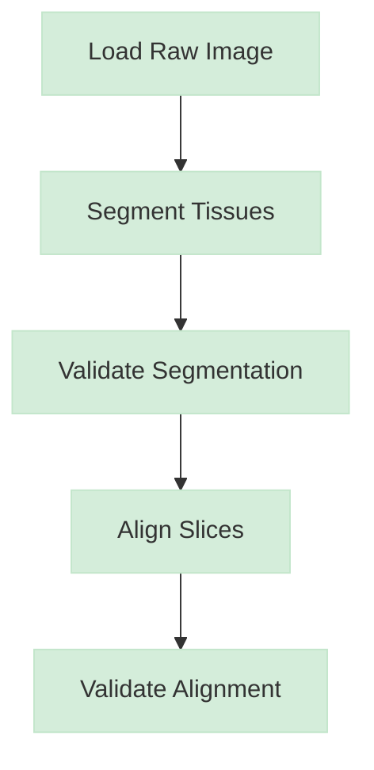
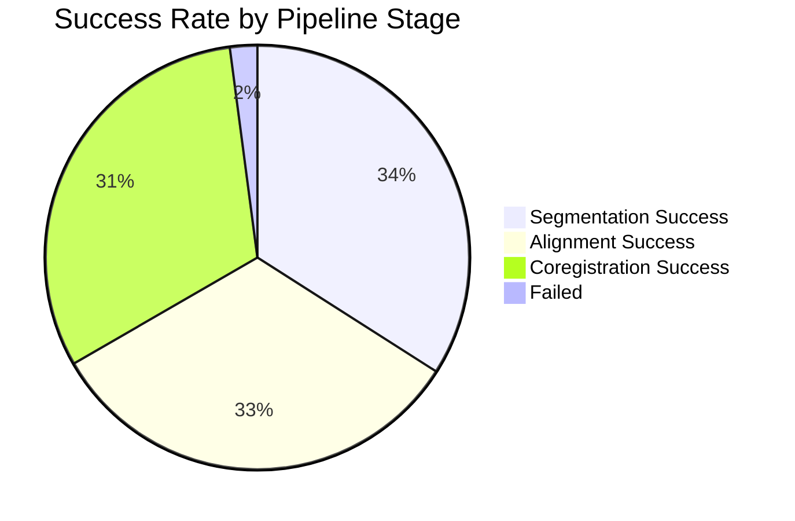

# Pipeline Visual Reporting System Implementation Plan

**Date**: June 19, 2025  
**Objective**: Implement a comprehensive visual reporting system with Markdown, Mermaid diagrams, and embedded visualizations for IQID-Alphas pipelines.

---

## **Overview**

This plan implements a two-tiered visual reporting system:

1. **Per-Sample Visual Reports**: Rich Markdown documents with Mermaid flowcharts and embedded images
2. **Batch Summary Reports**: High-level analysis with aggregated metrics and visualizations

### **Core Visual Components**

1. **Dynamic Mermaid Flowcharts**: Process flow visualization with color-coded success/failure nodes
2. **Embedded Image Visualizations**: Step-by-step visual evidence of pipeline outcomes
3. **Formatted Markdown Structure**: Context, metrics, and summary tables

---

## **Implementation Tasks**

### **Task RPT-1: Core Visualization Artifacts**
**Objective**: Create visualization generation infrastructure

#### Sub-tasks:
- **RPT-1.1**: Enhance visualization system
  - Update `iqid_alphas/visualization/enhanced_plotter.py`
  - Add segmentation mapping functions
  - Add alignment animation generation (GIF/video)
  - Add co-registration overlay functions
  - **Deliverable**: Enhanced plotter with all visualization types

- **RPT-1.2**: Create visualization templates
  - Design consistent visual styling
  - Create color schemes for different pipeline stages
  - Define image dimensions and formats
  - **Deliverable**: Visualization style guide and templates

- **RPT-1.3**: Implement step-specific visualizers
  - `SegmentationVisualizer`: Bounding boxes, tissue maps, IoU heatmaps
  - `AlignmentVisualizer`: Before/after overlays, transformation animations
  - `CoregistrationVisualizer`: Checkerboard overlays, mutual information maps
  - **Deliverable**: Specialized visualizer classes

**Estimated Effort**: 3-4 days

---

### **Task RPT-2: Visual Report Generator**
**Objective**: Create Markdown report generation system

#### Sub-tasks:
- **RPT-2.1**: Implement Mermaid diagram generation
  - Create `iqid_alphas/reporting/mermaid_generator.py`
  - Dynamic flowchart generation based on pipeline steps
  - Color-coding for success/failure states
  - **Deliverable**: Mermaid diagram generator

- **RPT-2.2**: Create Markdown report templates
  - Per-sample report template
  - Batch summary report template
  - Error report templates
  - **Deliverable**: Template system

- **RPT-2.3**: Implement report assembly system
  - `iqid_alphas/reporting/report_generator.py`
  - Combine text, diagrams, and image links
  - Markdown formatting and validation
  - **Deliverable**: Complete report generator

**Estimated Effort**: 2-3 days

---

### **Task RPT-3: Pipeline Integration for Visual Reporting**
**Objective**: Update pipelines to generate visual artifacts at each step

#### Sub-tasks:
- **RPT-3.1**: Refactor base pipeline for step tracking
  - Update `iqid_alphas/pipelines/base.py`
  - Add step result collection
  - Add visualization hooks
  - **Deliverable**: Enhanced base pipeline class

- **RPT-3.2**: Update segmentation pipeline
  - Add visualization calls after each processing step
  - Generate segmentation maps and validation plots
  - Collect step metadata for reporting
  - **Deliverable**: Visual segmentation pipeline

- **RPT-3.3**: Update alignment pipeline
  - Add before/after alignment visualizations
  - Generate transformation animations
  - Add quality metric visualizations
  - **Deliverable**: Visual alignment pipeline

- **RPT-3.4**: Update coregistration pipeline
  - Add multi-modal overlay visualizations
  - Generate registration quality maps
  - Add feature matching visualizations
  - **Deliverable**: Visual coregistration pipeline

**Estimated Effort**: 4-5 days

---

### **Task RPT-4: Report Integration System**
**Objective**: Integrate report generation into pipeline execution

#### Sub-tasks:
- **RPT-4.1**: Implement step result collection
  - Create result data structures
  - Add metadata collection hooks
  - Implement visualization path tracking
  - **Deliverable**: Result collection system

- **RPT-4.2**: Add report generation triggers
  - Call report generator after each sample completion
  - Handle error cases and partial results
  - Implement cleanup and resource management
  - **Deliverable**: Integrated reporting system

- **RPT-4.3**: Create CLI reporting options
  - Add `--generate-reports` flag
  - Add `--report-format` options (markdown, html, pdf)
  - Add `--visualization-detail` levels
  - **Deliverable**: CLI reporting interface

**Estimated Effort**: 2-3 days

---

### **Task RPT-5: Batch Summary Reporting**
**Objective**: Create high-level batch analysis reports

#### Sub-tasks:
- **RPT-5.1**: Implement batch metrics aggregation
  - Success/failure rates by pipeline stage
  - Performance metrics and timing analysis
  - Quality metric distributions
  - **Deliverable**: Batch metrics system

- **RPT-5.2**: Create batch visualizations
  - Success rate charts
  - Performance trend plots
  - Quality metric histograms
  - **Deliverable**: Batch visualization system

- **RPT-5.3**: Generate batch summary reports
  - Executive summary with key metrics
  - Detailed analysis tables
  - Recommendation generation
  - **Deliverable**: Complete batch reporting system

**Estimated Effort**: 2-3 days

---

### **Task RPT-6: Testing and Validation**
**Objective**: Ensure reporting system reliability and quality

#### Sub-tasks:
- **RPT-6.1**: Create visualization tests
  - Test image generation functions
  - Validate visual output quality
  - Test animation generation
  - **Deliverable**: Visualization test suite

- **RPT-6.2**: Create report generation tests
  - Test Markdown generation
  - Validate Mermaid diagram syntax
  - Test image link validation
  - **Deliverable**: Report generation test suite

- **RPT-6.3**: Integration testing
  - End-to-end pipeline reporting tests
  - Performance impact assessment
  - Error handling validation
  - **Deliverable**: Comprehensive test coverage

**Estimated Effort**: 2-3 days

---

## **Technical Architecture**

### **Directory Structure**
```
iqid_alphas/
├── reporting/
│   ├── __init__.py
│   ├── report_generator.py      # Main report generation
│   ├── mermaid_generator.py     # Mermaid diagram creation
│   ├── templates/               # Report templates
│   │   ├── sample_report.md.j2
│   │   ├── batch_summary.md.j2
│   │   └── error_report.md.j2
│   └── styles/                  # Visualization styles
│       ├── colors.py
│       └── layouts.py
├── visualization/
│   ├── enhanced_plotter.py      # Enhanced with report visuals
│   ├── segmentation_viz.py      # Segmentation visualizations
│   ├── alignment_viz.py         # Alignment visualizations
│   └── coregistration_viz.py    # Coregistration visualizations
└── pipelines/
    ├── base.py                  # Enhanced with reporting hooks
    ├── segmentation.py         # Visual reporting integration
    ├── alignment.py            # Visual reporting integration
    └── coregistration.py       # Visual reporting integration
```

### **Data Flow**
```
Pipeline Step → Generate Visualization → Collect Metadata → 
Generate Report Section → Assemble Full Report → Save to Disk
```

---

## **Example Output Structure**

### **Per-Sample Report Example**
```markdown
# Pipeline Report: Sample_001_L

**Status**: ✅ Success  
**Processing Time**: 45.2 seconds  
**Timestamp**: 2025-06-19 08:16:25 EDT

## Pipeline Flow



## Step Details

### 1. Load Raw Image ✅
- **Status**: Success
- **Duration**: 2.1s
- **Details**: Loaded image with dimensions (2048, 1536, 3)

### 2. Segment Tissues ✅
- **Status**: Success  
- **Duration**: 15.8s
- **Tissues Found**: 2 types, 18 total slices
- **Quality Metrics**: IoU: 0.89, Dice: 0.94


### 3. Validate Segmentation ✅
- **Status**: Success
- **Duration**: 8.1s  
- **Validation Score**: 0.92


### 4. Align Slices ✅
- **Status**: Success
- **Duration**: 18.7s
- **Slices Aligned**: 18/18
- **Mean SSIM**: 0.87


### 5. Validate Alignment ✅
- **Status**: Success
- **Duration**: 0.5s
- **Alignment Quality**: 0.89


## Summary

✅ **Pipeline completed successfully**
- Total processing time: 45.2 seconds
- All validation thresholds met
- High-quality results achieved

## Artifacts Generated
- Segmented tissues: `output/Sample_001_L/segmented/`
- Aligned slices: `output/Sample_001_L/aligned/`
- Quality reports: `output/Sample_001_L/validation/`
```

### **Batch Summary Report Example**
```markdown
# Batch Processing Summary

**Run ID**: batch_2025_06_19_081625  
**Total Samples**: 50  
**Success Rate**: 94% (47/50)  
**Total Time**: 38.2 minutes

## Success Overview



## Performance Metrics

| Metric | Mean | Std | Min | Max |
|--------|------|-----|-----|-----|
| Total Time (s) | 45.8 | 12.3 | 28.1 | 78.2 |
| Segmentation IoU | 0.87 | 0.08 | 0.72 | 0.95 |
| Alignment SSIM | 0.84 | 0.11 | 0.58 | 0.94 |


## Recommendations

1. ✅ Overall pipeline performance is excellent
2. ⚠️ 3 samples failed alignment - investigate image quality
3. 📈 Consider optimizing segmentation for 6% improvement
```

---

## **Implementation Timeline**

| Week | Tasks | Deliverables |
|------|-------|-------------|
| **Week 1** | RPT-1, RPT-2.1 | Visualization system, Mermaid generator |
| **Week 2** | RPT-2.2, RPT-2.3, RPT-3.1 | Report templates, generator, base pipeline |
| **Week 3** | RPT-3.2, RPT-3.3, RPT-3.4 | Visual pipeline integration |
| **Week 4** | RPT-4, RPT-5 | Integration system, batch reporting |
| **Week 5** | RPT-6 | Testing and validation |

**Total Estimated Effort**: 15-21 days (3-4 weeks)

---

## **Success Criteria**

### **Technical Requirements**
- [ ] All pipelines generate per-sample visual reports
- [ ] Mermaid diagrams render correctly in Markdown
- [ ] All visualizations are high-quality and informative
- [ ] Batch summary reports provide actionable insights
- [ ] Reports integrate seamlessly with existing CLI

### **Quality Requirements**
- [ ] Visual artifacts clearly show pipeline step outcomes
- [ ] Reports are readable and professionally formatted
- [ ] Error cases are handled gracefully with informative output
- [ ] Performance impact is minimal (<10% overhead)

### **User Experience**
- [ ] Reports provide immediate visual feedback
- [ ] Complex technical information is accessible
- [ ] Reports support decision-making and debugging
- [ ] Batch analysis enables process optimization

---

## **Risk Mitigation**

| Risk | Impact | Mitigation |
|------|--------|------------|
| Performance overhead | High | Implement async visualization, optional detail levels |
| Large file sizes | Medium | Optimize image compression, lazy loading |
| Complex dependencies | Medium | Minimize external deps, fallback options |
| Maintenance burden | Medium | Comprehensive testing, modular design |

---

This plan prioritizes visual impact while maintaining technical excellence and usability. The resulting system will provide immediate, actionable insights into pipeline performance through rich visual reports.
